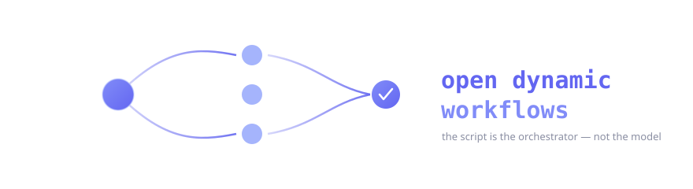

<p align="center">
  
</p>

<p align="center">
  
  = 20">
  
  
  
</p>

When you ask one LLM to coordinate fifty agents, it spends its context window keeping track of the other forty-nine. The good agentic harnesses got around this by having the model write a *script* once — a plain JavaScript function that loops, fans out, verifies, and returns — and then a runtime executes that script while the model goes quiet. The model is the author. The script is the orchestrator. That trick is why a coding agent can run a hundred sub-agents for an hour without losing the plot.

That capability has been locked to one tool. This is the same idea, MIT-licensed, running on your machine, talking to whatever model you already pay for.

It ships as a small local daemon plus thin adapters for the agents you already use — OpenCode, Codex, Antigravity, VS Code, or a bare shell. No accounts, no hosted backend, no telemetry. You bring an API key (or point it at Ollama and bring nothing).

```
you ──▶ "workflow: audit every endpoint for missing auth"
        │
        ├─ plan      25 agents · adversarial verification · ~$0.30 · ~4 min
        ├─ confirm   [run] [view script] [edit]
        └─ run       ▶ wf_9f3c2a  → 200 endpoints checked, 6 real issues, report written
```

---

## How it works

The model never babysits the swarm. It writes one `execute(context)` function and hands it to the daemon. The daemon runs that function inside a WASM-isolated QuickJS sandbox where the only things in scope are the workflow primitives — `agent`, `parallel`, `pipeline`, `verify`, `loop`, `checkpoint`. Every `agent()` call becomes one HTTP request to a model provider, scheduled through a concurrency queue. Results stream back into the script. Your chat window only sees the final answer.

```mermaid
flowchart LR
    U[your prompt] --> P[plan: task graph + topology + roles]
    P --> S[compiled execute&#40;context&#41; script]
    S --> SB[quickjs sandbox]
    SB -->|agent&#40;&#41; x N| Q[concurrency queue]
    Q --> L[(your LLM provider)]
    L --> Q --> SB
    SB --> V[adversarial verify] --> R[final result]
    SB -.checkpoint.-> DB[(sqlite + WAL)]
    DB -.crash? resume here.-> SB
```



Two things make this usable rather than a demo:

- **It survives.** State lives in SQLite with write-ahead logging. Kill the daemon mid-run, start it again with `--resume`, and the completed agents come back from cache — only the unfinished work re-runs. Node identity is `sha1(workflow | phase | role | prompt)`, so replay is exact, not approximate.
- **It doesn't trust its own agents.** A finding isn't a finding until a panel of skeptics has tried to knock it down. The `verify` primitive runs critics that hunt false positives, challenge severity, and look for what's missing, then keeps only what survives a quorum.

## Topologies

The planner picks the simplest shape that fits the task instead of throwing a swarm at everything.

| Topology | Shape | Good for |
|----------|-------|----------|
| MapReduce | split → map in parallel → reduce | auditing 500 files, the same check across many items |
| Pipeline | stage → stage → stage, per item, no barrier | migrate → test → fix, where item A streams ahead of item B |
| Adversarial | propose → critique → fix → re-verify | anything that has to be *correct*, not just plausible |
| Consensus | many evaluators → weighted vote | uncertain facts, research, judgement calls |
| Tree search | expand → score → prune → backtrack | root-cause hunts, branching exploration |
| Hybrid | the above, composed | real features that have several phases |

## Quick start

> **Install from GitHub** — this is not on the npm registry yet, so install by cloning. (Heads up: an unrelated package happens to sit at the name `open-dynamic-workflows` on npm — don't `npm install` that; it isn't this project.)

Clone, install, and let the setup script write a starter config and put the daemon on your PATH. Works the same on macOS, Linux, and Windows (PowerShell or cmd).

```bash
git clone https://github.com/Suraj1235/open-dynamic-workflows
cd open-dynamic-workflows
npm install
npm run setup
```

`npm run setup` creates `~/.odw/config.json`. Add one key and you're done:

```json
{
  "apiKeys": { "anthropic": "sk-ant-..." },
  "models": { "planning": "gpt-4o-mini", "default": "claude-sonnet-4-6" }
}
```

No cloud key? Run a local model and pay nothing — no key needed at all. Point all three model roles at it so planning and fallbacks stay on the free model too:

```json
{ "models": { "planning": "ollama:llama3", "default": "ollama:llama3", "fallback": "ollama:llama3" } }
```

**Any OpenAI-compatible endpoint** works too — OpenCode Zen, Azure OpenAI, vLLM, LM Studio, Together, Groq. Point `baseURLs.default` at it and put the key under `apiKeys.default`:

```json
{
  "baseURLs": { "default": "https://opencode.ai/zen/v1" },
  "apiKeys":  { "default": "your-key" },
  "models":   { "planning": "minimax-m3-free", "default": "minimax-m3-free", "fallback": "minimax-m3-free" }
}
```

If the configured model has no key or route, `odw-daemon run` tells you up front (before planning) exactly which line of `~/.odw/config.json` to fix — no silent first-run failures.

Model routing is automatic: `claude-*` → Anthropic, `gpt-*`/`o*` → OpenAI, `ollama:*` → local Ollama, `provider:model` → a named `baseURLs.<provider>`, and anything else → `baseURLs.default`. So you can run entirely on a free model with no cloud spend.

Then drive it straight from a shell, no editor required:

```bash
odw-daemon start
odw-daemon run --prompt "workflow: find every TODO that hides a real bug" --cwd ./my-project
```

Prefer not to install globally? Every command also runs from the repo: `npm start`, `npm run status`, `npm run odw -- run --prompt "..."`.

```
plan
  topology     hybrid
  agents       ~22 (max 16 concurrent)
  est. cost    $0.18
  est. time    ~3 min
▶ workflow wf_4a1b9c running
✓ completed
```

## Inside your agent

The daemon is the engine; the adapters are how your existing tool talks to it. Each one is a real, separate package — install only what you use.

**OpenCode** — drop-in plugin. Add it to `opencode.json`:

```json
{ "plugin": ["odw-opencode"] }
```

Now any message that means "run a workflow" (or the word `ultracode`, or `/deep-research`) gets planned and executed through the daemon. With the daemon off, the plugin degrades gracefully: it tells the model to orchestrate with OpenCode's own sub-agents instead, capped at whatever the platform allows.

**Codex / Antigravity** — a skill folder (`SKILL.md` + a zero-dependency bridge script) that teaches the agent to plan first and call the daemon. There is, honestly, no Codex plugin marketplace and no public Antigravity automation API — so these adapters use the extension points those tools actually have (skills, `AGENTS.md`, saved workflows) and say so out loud.

**VS Code** — a sidebar of live workflows, a dashboard webview, and a status bar that turns into a spinner while agents run. Being a VS Code extension, it loads in Antigravity unchanged.

## The script the model writes

You never have to write one of these by hand, but it's worth seeing what the planner compiles, because there's no magic underneath:

```js
async function execute(context) {
  phase("Discovery");
  const files = await context.tools.glob("src/routes/**/*.{js,ts}");

  phase("Audit");
  const findings = await parallel(
    files.map(f => () => agent({
      role: "security-auditor",
      prompt: `Check ${f} for missing auth. Return JSON {findings, confidence}.`,
      schema: { findings: "array", confidence: "number" },
      tools: ["read_file"],
    })),
    { maxConcurrency: 16 }
  );
  await checkpoint({ phase: "audit", findings });

  phase("Verification");
  const verified = await verify({
    target: findings,
    mode: "adversarial",
    critics: [
      { role: "false-positive-hunter", prompt: "Find false positives." },
      { role: "severity-validator",    prompt: "Challenge every severity rating." },
    ],
    consensusThreshold: 2,
  });

  phase("Synthesis");
  return agent({ role: "report-writer", prompt: `Write the report from ${JSON.stringify(verified)}` });
}

module.exports = { execute };
```

Three runnable examples live in [`examples/workflows/`](examples/workflows): a security audit (MapReduce + adversarial), a JS→TS migration (pipeline), and deep research (consensus).

## Where things are

```
packages/
  core/                 planning, topology selection, script generation  (zero I/O, pure)
  daemon/               the engine — sandbox, queue, providers, sqlite, http/ws, cli
  opencode-plugin/      OpenCode plugin + custom tools + slash commands
  codex-adapter/        Codex skill folder + daemon bridge
  antigravity-adapter/  Antigravity skill + saved workflow
  vscode-extension/     tree view, dashboard webview, status bar
examples/workflows/     runnable orchestration scripts
```

## Safety, briefly

- The sandbox is QuickJS compiled to WebAssembly. A workflow script gets the primitives and nothing else — no `fs`, no `process`, no `require`, no network. (We picked WASM-QuickJS over `vm2`, which was abandoned in 2023 and has since collected critical sandbox-escape CVEs.)
- File writes, shell commands, and git operations are approval-gated by default. Read-only work runs free.
- Your API keys live in `~/.odw/config.json` on your disk. They are never written to logs, never put in a workflow record, never returned in an HTTP error. The logger redacts key-shaped strings on the way out.
- The daemon binds to `127.0.0.1` only. It is a localhost service, not a server.
- Every run has a hard token and dollar budget. It warns at 80% and stops at 100%.

## Built it? Run the tests

```bash
git clone https://github.com/Suraj1235/open-dynamic-workflows
cd open-dynamic-workflows
npm install
npm test          # unit + integration + a real crash-resume test
npm run lint
```

## License

MIT. Take it, fork it, ship it. See [LICENSE](LICENSE).
